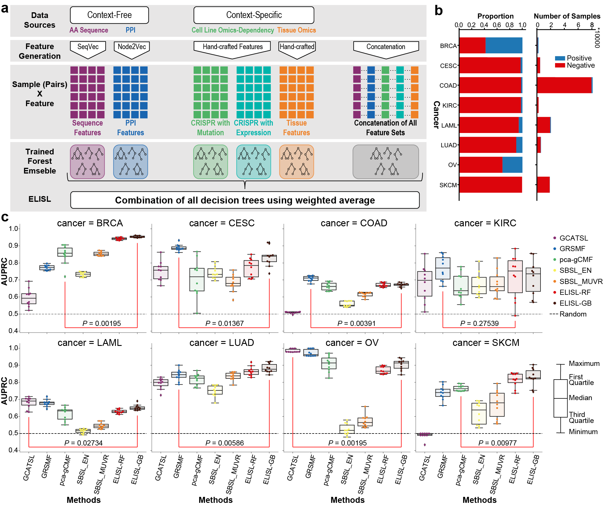

<h1>
  <br>
  <a href="https://gitlab.tudelft.nl/ytepeli/elsl/-/archive/master/elsl-master.zip">ELISL</a>
</h1> 

<h4 align="center">Early Late Synthetic Lethality Predictors in Cancer</h4>

<p>
    <a href="https://gitlab.tudelft.nl/ytepeli/elsl/-/commits/master">
    
    <a href="https://gitlab.tudelft.nl/ytepeli/elsl/-/issues">
    
    <a href="https://gitlab.tudelft.nl/ytepeli/elsl/-/branches">
    
    <a href="https://twitter.com/intent/tweet?text=Try this ELISL Predictor AutoExec:&url=https%3A%2F%2Fgitlab.tudelft.nl%2Fytepeli%2Felsl">
    
    
</p>
      
<p>
  <a href="#abstract">Abstract</a> •
  <a href="#repository-description">Repository Description</a> •
  <a href="#framework-and-single-cancer-experiment">Framework and Single Cancer Experiment</a> •
  <a href="#installation-and-dependencies">Installation and Dependencies</a> •
  <a href="#dataset-generation">Dataset Generation</a> •
  <a href="#direct-usage-of-elisl">Direct Usage of ELISL</a> •
  <a href="#code-integration">Code Integration</a> •
  <a href="#bibtext-reference">Bibtext Reference</a> •
  <a href="#license">License</a>
</p>


---

## Abstract

<table>
<tr>
<td>
  
Anti-cancer therapies based on synthetic lethality (SL) exploit tumour vulnerabilities for treatment with reduced side effects, by targeting a gene that is jointly essential with another whose function is lost. Computational prediction is key to expedite SL screening, yet existing methods are vulnerable to prevalent selection bias in SL data and reliant on cancer or tissue type-specific omics, which can be scarce. Notably, sequence similarity remains underexplored as a proxy for related gene function and joint essentiality. We propose ELISL, Early–Late Integrated SL prediction with forest ensembles, using context-free protein sequence embeddings and context-specific omics from cell lines and tissue. Across eight cancer types, ELISL showed superior robustness to selection bias and recovery of known SL genes, as well as promising cross-cancer predictions. Co-occurring mutations in a BRCA gene and ELISL-predicted pairs from the HH, FGF, WNT, or NEIL gene families were associated with longer patient survival times, revealing therapeutic potential. Data: https://doi.org/10.6084/m9.figshare.23607558. Code: https://github.com/joanagoncalveslab/ELISL.  

In Bioinformatics 19 Dec 2023: <a href="https://doi.org/10.1093/bioinformatics/btad764">ELISL: early-late integrated synthetic lethality prediction in cancer</a>
An earlier preprint appeared in <a href="https://doi.org/10.1101/2022.09.19.508413">bioRxiv</a> on 19 Sep 2022.

</td>
</tr>
</table>


## Framework and Single Cancer Experiment

*ELISL framework, SL label imbalance, and within cancer prediction performance.*  
**a,** The ELISL framework: six forest ensemble models learn separately from two context-free sources, three context-specific sources, and all data sources together. Context-free sources, amino acid sequence, and PPI. Context-specific sources include: cell line dependency and mutation; cell line dependency and expression; tissue mutation, expression, copy number, and patient survival. Features for context-free sources express sequence and PPI similarity based on embeddings, while features for context-specific sources denote various statistical measures based on molecular profiles.
The prediction probabilities of the six models are aggregated using weighted average to obtain the final prediction probability for each gene pair. **b,** Number and ratio of positive and negative samples in the train set for each cancer type. **c,** Prediction performance (AUPRC) of SL prediction methods per cancer type over 10 runs using undersampled 80/20 train/test splits (same cancer). 
Method categories: SL-topology (GCATSL, GRSMF, pca-gCMF); supervised learning, including existing models (SBSL-EN/MUVR), and our proposed ELISL models (ELISL-RF/GB).
Red lines compare the best ELISL model with the best among the other models. \textit{P} shows the significance of the difference in performance between models over 10 runs, using a two-sided Wilcoxon signed rank test.


## Repository Description

##### Folder hierarchy:
* **data**: Includes all the data for feature generation or experiments.
  * **experiment_configs**: Includes config for each experiment. You can also create and put your config file there.
  * **feature_sets**: datasets for each label file and readily available train and test samples at each run for each experiment.
  * **labels**: csv label files with [gene1, gene2, cancer, class].
  * **ccle_broad_2019**: Source folder for cell line feature generation.
  * **tissue_data**: Source folder for tissue feature generation.
  * **embeddings**: Saved embeddings from Node2Vec or SeqVec to be used in feature generation.
* **logs**: Log files for each of the experiment and feature generation.
* **results**: json model files and csv experiment performance result files.
* **src**: Includes all the codes for the application.
  * **comparison**: Includes the codes of the comparison methods which are in python.
  * **datasets**: Includes codes to preprocess the cell line, tissue or pathway files.
  * **embeddings**: Includes the codes for either sequence or PPI embeddings or handcrafting the tissue or cell line features.
  * **experiments**: Includes the codes for single cancer, double holdout, cross dataset experiments.
  * **feature_generation**: Includes the codes to create feature sets from sequence embeddings, PPI embeddings, tissue and cell lines.
  * **lib**: Includes the sutils code for project.
  * **models**: Includes ELRRF and ELGLMNET(not used) models.


## Installation and Dependencies

##### Dependencies
* Python3.6 or Python3.7
* pip3.6 install -r requirements.txt

##### Installation
* Open terminal and go to the folder to install the project
* install the virtual environment library: `python3.6 -m pip install --user virtualenv`
* create and activate virtual environment: `python3.6 -m venv elisl_env | source elisl_env/bin/activate`
  * Detail: https://packaging.python.org/guides/installing-using-pip-and-virtual-environments/
* Clone the project: `git clone https://gitlab.tudelft.nl/ytepeli/ELISL.git`
* Enter project and install requirements: `cd ELISL | pip3.6 install -r requirements.txt`


## Dataset Generation

##### Sequence Dataset and Example Usage
* Download <a href="https://www.uniprot.org/uniprot/?query=reviewed\%3Ayes++AND+organism\%3A\%22Homo+sapiens+\%28Human\%29+\%5B9606\%5D\%22&sort=score">reviewed amino acid fasta sequence from UniProt</a> and extract graph as: `ELISL/data/sequences/uniprot_reviewed_9606.fasta`
* Create embeddings for each protein: 
```
seqvec -i uniprot_reviewed_9606.fasta -o data/embeddings/seqvec/uniprot_1024_embeddings.npz --id 0 --protein
```
* Create sequence dataset for training samples using embeddings:
```
python3.6 src/feature_generation/sequence_features.py -sn train -sl labels/train_pairs.csv -ol feature_sets/train_seq_1024.csv -el embeddings/seqvec/uniprot_1024_embeddings.npz
```
* You can see the possible arguments using `python3.6 src/feature_generation/sequence_features.py -h`

##### PPI Dataset
* Download <a href="https://stringdb-static.org/download/protein.links.v11.0/9606.protein.links.v11.0.txt.gz">STRING PPI Graph</a> and extract graph as: `ELISL/data/PPI/STRING/9606.protein.links.full.v11.0.txt`
  * Download <a href="https://stringdb-static.org/download/protein.info.v11.5/9606.protein.info.v11.5.txt.gz">ProteinInfo</a>, <a href="https://string-db.org/mapping_files/STRING_display_names/human.name_2_string.tsv.gz">Name2String</a>, <a href="https://string-db.org/mapping_files/uniprot/human.uniprot_2_string.2018.tsv.gz">Uniprot2String</a> mappings, extract from gzip and put it in `ELISL/data/PPI/STRING` folder. The required other mappings are already in the folder.
* Create embeddings for each protein: 
```
python3.6 src/embedding/ppi_embedding.py
```
* Create PPI dataset for training samples using embeddings:
```
python3.6 src/feature_generation/PPI_features.py -sn train -sl labels/train_pairs.csv -ol feature_sets/train_ppi_ec.csv -el embeddings/node2vec/embs_ppi_ec=0.0_dim=64_p=1_q=1_wl=30_nw=200_ws=4_wd=10_mc=1_bw=4
```
* You can see the possible arguments using `python3.6 src/feature_generation/PPI_features.py -h`

##### Tissue Dataset
* Download tumor and healthy omics and clinical files:
  * Download <a href="https://www.cbioportal.org/study/summary?id=brca_tcga%2Ccesc_tcga%2Ccoadread_tcga%2Ckirc_tcga%2Claml_tcga%2Cluad_tcga%2Cov_tcga%2Cskcm_tcga">TCGA omics and clinical data</a> for each cancer type and extract their folder `cancer_tcga` to `ELISL/data/tissue_data` folder.
  * Download <a href="https://storage.googleapis.com/gtex_analysis_v8/rna_seq_data/GTEx_Analysis_2017-06-05_v8_RNASeQCv1.1.9_gene_tpm.gct.gz">GTEX gene expression</a> and <a href="https://storage.googleapis.com/gtex_analysis_v8/annotations/GTEx_Analysis_v8_Annotations_SampleAttributesDS.txt">GTEX annotation</a>, then put files to `ELISL/data/tissue_data/gtex` folder.
* Process tissue related data: 
```
python3.6 src/datasets/tissue.py
```
* Create hand-crafted tissue dataset for training samples:
```
python3.6 src/feature_generation/tissue_features.py -sn train -sl labels/train_pairs.csv -ol feature_sets/train_tissue.csv -co 1.96
```
* You can see the possible arguments using `python3.6 src/feature_generation/tissue_features.py -h`

##### Cell Line Datasets
* Download cell line omics and dependency scores, and extract the files inside to `ELISL/data/ccle_broad_2019` folder:
  * Download <a href="https://www.cbioportal.org/study/summary?id=ccle_broad_2019">cell line omics</a>.
  * Download <a href="https://depmap.org/portal/download/all/?release=DepMap+Public+18Q3&file=gene_dependency.csv">CRISPR dependency scores</a>.
* Create hand-crafted cell line dataset with crispr as dependency source and mutation or expression as alteration source for training samples:
```shell script
python3.6 src/feature_generation/cell_line_features.py -sn train -sl labels/train_pairs.csv -ol feature_sets/train_crispr_dependency_expr_co=1.96.csv -ds crispr -as expression -co 1.96
python3.6 src/feature_generation/cell_line_features.py -sn train -sl labels/train_pairs.csv -ol feature_sets/train_crispr_dependency_mut.csv -ds crispr -as mutation
``` 
* You can see the possible arguments using `python3.6 src/feature_generation/cell_line_features.py -h`


## Direct Usage of ELISL

#### Single Cancer Experiment for Breast Cancer with ELRRF
```shell script
python3.6 src/experiments/single_cancer_experiment.py --model ELRRF --balance_strategy undersample_train_test
--grid_search true --cancer BRCA --n_split 10 --process true --threshold 0.5
--exp_file ~/ELISL/data/experiment_configs/single_cancer_config.json
```
The config file example:
```json
{
  "labels":{
    "train": "labels/train_pairs.csv",
    "test": "labels/test_pairs.csv"
  },
  "feature_sets": {
    "Sequence_1024": {
      "train": "feature_sets/train_seq_1024.csv",
      "test": "feature_sets/test_seq_1024.csv"
    },
    "PPI_ec": {
      "train": "feature_sets/train_ppi_ec.csv.gz",
      "test": "feature_sets/test_ppi_ec.csv.gz"
    },
    "Crispr_Dependency_Mut": {
      "train": "feature_sets/train_crispr_dependency_mut.csv.gz",
      "test": "feature_sets/test_crispr_dependency_mut.csv.gz"
    },
    "Crispr_Dependency_Expr": {
      "train": "feature_sets/train_crispr_dependency_expr_co=1.96.csv.gz",
      "test": "feature_sets/test_crispr_dependency_expr_co=1.96.csv.gz"
    },
    "Tissue": {
      "train": "feature_sets/train_tissue.csv.gz",
      "test": "feature_sets/test_tissue.csv.gz"
    }
  }
}
```
Label file example:
```text
gene1,gene2,cancer,class
BRCA1,PARP1,BRCA,1
BRCA2,PARP1,BRCA,1
MYC, YES1, LUAD, 0
```
Feature set example:
```text
gene1,gene2,cancer,class,feature0,feature1,feature2,feature3,feature4
GATA3,IL6ST,BRCA,1,6.05,1.11,1.68,5.33,2.52
AKT2,PARP1,BRCA,0,3.60,2.91,2.92,7.55,1.68
ABCC4,FBN1,BRCA,1,0.17,1.02,0.65,3.27,7.36
```
Note that the algorithm automatically tries to match and sort the pairs in sample files with pairs in feature files.

You can see the saved model in `data/results/ELRRF/models_single_cancer` folder and 
results in `data/results/ELRRF/single_cancer_experiment.csv` file.

All the data required to repeat the experiments are shared at <a href="https://surfdrive.surf.nl/files/index.php/s/ur4PgYftwnXASlx">SurfDrive</a>.

## Code Integration


# Bibtex-Reference
```
@article{Tepeli2023elisl,
    author = {Tepeli, Yasin I and Seale, Colm and Gonçalves, Joana P},
    title = {{ELISL: early–late integrated synthetic lethality prediction in cancer}},
    journal = {Bioinformatics},
    volume = {40},
    number = {1},
    pages = {btad764},
    year = {2023},
    month = {12},
    abstract = {{Anti-cancer therapies based on synthetic lethality (SL) exploit tumour vulnerabilities for treatment with reduced side effects, by targeting a gene that is jointly essential with another whose function is lost. Computational prediction is key to expedite SL screening, yet existing methods are vulnerable to prevalent selection bias in SL data and reliant on cancer or tissue type-specific omics, which can be scarce. Notably, sequence similarity remains underexplored as a proxy for related gene function and joint essentiality. We propose ELISL, Early–Late Integrated SL prediction with forest ensembles, using context-free protein sequence embeddings and context-specific omics from cell lines and tissue. Across eight cancer types, ELISL showed superior robustness to selection bias and recovery of known SL genes, as well as promising cross-cancer predictions. Co-occurring mutations in a BRCA gene and ELISL-predicted pairs from the HH, FGF, WNT, or NEIL gene families were associated with longer patient survival times, revealing therapeutic potential. Data: 10.6084/m9.figshare.23607558. Code: github.com/joanagoncalveslab/ELISL.}},
    issn = {1367-4811},
    doi = {10.1093/bioinformatics/btad764},
    url = {https://doi.org/10.1093/bioinformatics/btad764}
}
```

## License

[](https://tldrlegal.com/license/gnu-lesser-general-public-license-v3-(lgpl-3))

- Copyright © [ytepeli].
